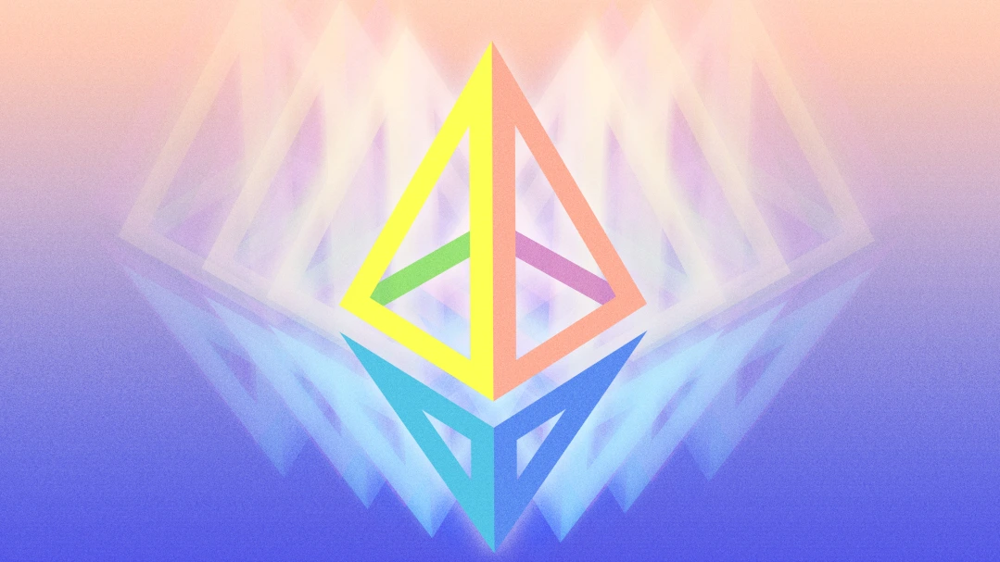
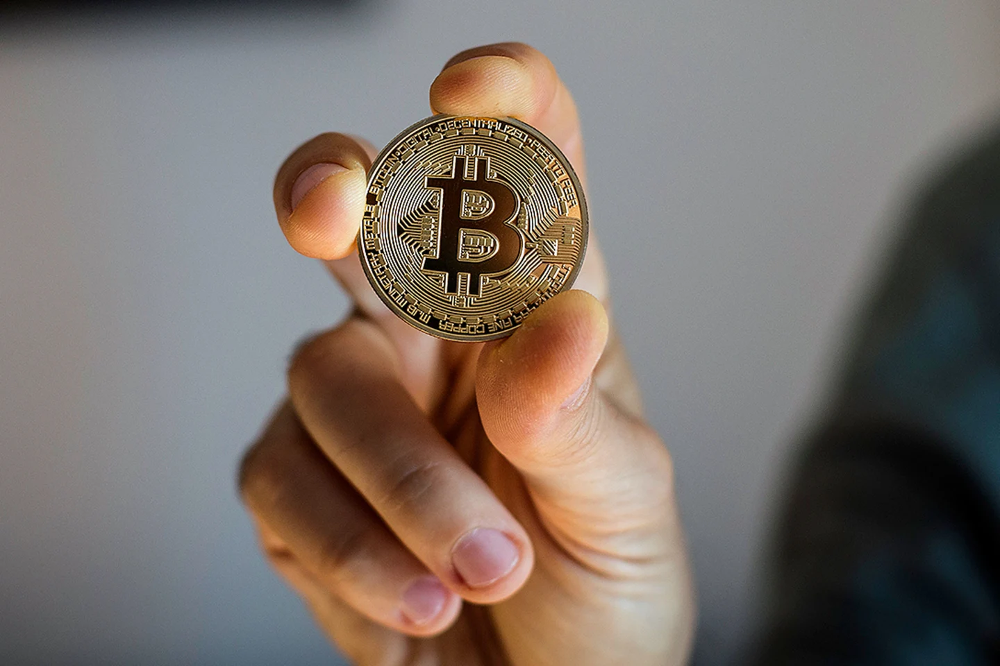

# FinTech Case Study
## By: Gabriel Millan
## Ethereum in Blockchain & Cryptocurrency

## Introduction
All industries around the world, from supermarkets to healthcare are being impacted by the advancements in software, digital, and data technology. The financial and banking industry is no exception, the technology has completely changed the way individuals and businesses interact with one another, from payments and real estate to investments and personal finance. Some of the most discussed FinTech’s (financial technologies) in today’s media outlets, political talks, and regulators are blockchain and cryptocurrency. [McKinsey & Company](https://www.mckinsey.com/cn/our-insights/our-insights/seven-technologies-shaping-the-future-of-fintech) listed blockchain as one of the seven “technologies shaping the future of fintech.” (Source #1).

This case study will begin with the background and overview of one of the most discussed companies in FinTech today, Ethereum. It will discuss the origins and founders of the company, followed by the initial funding and an overview of its domain. After a base understanding of Ethereum's origins, the case study will dive deeper into the company's business activities and landscape to explain how it has managed to create a business model that both individuals and companies in multiple industries can use its technology. This will lead to an overview of the trends of the company, with an analysis on how it has grown in value and market share.

Lastly, the case study will conclude with where the company is today, how it is currently performing, and my recommendations of its use in the near future. Because of the technological complexity, and sometimes confusing language Ethereum is in, there is also an appendix section where some of the key topics and explanations of blockchain and cryptocurrency can be found. If the topic and Ethereum is new to the reader, it is highly suggested that the appendix section is reviewed as it gives a base understanding of topics discussed in this case study. Please note that the appendix information is at a very high level, and there may be some outside reading and learning required to fully understand the Ethereum case study.

## Ethereum: A Background & Overview
By 2022 most individuals in the financial and technology sectors have heard of Ethereum. It is mostly known as a cryptocurrency like Bitcoin, however, it has a lot of other technological capabilities that makes the company more dynamic. As stated in Ethereum's [website](https://ethereum.org/en/what-is-ethereum/) "Ethereum is a technology for building apps and organizations, holding assets, transacting and communicating without being controlled by a central authority. There is no need to hand over all of your personal details to use Ethereum - you keep control of your own data and what is being shared." (Source #6) 

Ethereum was founded by Vitalik Buterin in 2013, with the [vision](https://www.wired.com/2014/01/ethereum/) of being "an online service that lets you build practically anything in the image of bitcoin and run it across a worldwide network of machines." (Source #18). Ethereum was fully created with four other co-founders, Gavin Wood, Charles Hoskinson, Anthony Di Lorio and Joseph Lubin as they contributed to the finalized software and platform Ethereum is today. In July 2015, Ethereum officially announced the launch of their development in their website, [Ethereum.org](https://blog.ethereum.org/2015/07/30/ethereum-launches) (Source #7). The project for Ethereum raised capital via an [Initial Coin Offiring (ICO)](https://cointelegraph.com/ethereum-for-beginners/history-of-eth-the-rise-of-the-ethereum-blockchain) "selling millions of dollars worth of ETH coins in exchange for funds to use for the development of the project. Between July 22 and Sept. 2, 2014, the asset sale sold over $18 million worth of ETH, paid for in Bitcoin." (Source #19)

Above Image: Founder of Ethereum Vitalik Buterin

Ethereum’s [domain](https://docs.soliditylang.org/en/v0.8.17/) is “influenced by C++, Python, and JavaScript.” (Source #8) The mechanics of Ethereum can be broken down to five main elements as described by [The Blockchain Review](https://static1.squarespace.com/static/567bb4f069a91a95348fa0b2/t/5ce11f4f0f06d30001ff5402/1558257488828/Intrepid+Ventures+Ethereum-White-Paper-Made-Simple.pdf) (Source #17): 
- Smart Contracts - Code that manages the exchange of anything of value from property and shares to information and money between parties
- The Ethereum Virtual Machine (EVM) - The EVM includes a Turing complete scripting language which means that it can solve any computation problem
- Solidity - Ethereum has its own programmable language called "Solidity". It enables developers to write programs on Ethereum and is designed to enhance the EVM.
- Ether - Ether is a necessary element for operating the Ethereum network. It is used by developers to pay for transaction fees for services and storage on the network.
- Proof of Stake - The owners offer their coins as collateral for a chance to validate blocks. Coin owners with staked coins become "validators."

## Ethereum Business Activities, Landscape, & Competition

Ethereum has grown tremendously since its launched, in 2019 [Forbes](https://www.forbes.com/sites/michaeldelcastillo/2019/04/16/blockchain-50-billion-dollar-babies/?sh=229250b557cc) released a list of 50 companies - with a minimum of $1 Billion in valuation that are involved in blockchain capabilities (Source #20). The report shows that 24 companies listed are using the Ethereum blockchain. The [list](https://www.forbes.com/sites/michaeldelcastillo/2019/04/16/blockchain-50-billion-dollar-babies/?sh=229250b557cc) shows that Ethereum is impacting a wide variety of markets, with companies such as Amazon, Fidelity, MetLife, Microsoft, Comcast, and Intel making use of Ethereum's technology. [Morgan Stanley](https://advisor.morganstanley.com/daron.edwards/documents/field/d/da/daron-edwards/Cryptocurrency_201__What_is_Ethereum_.pdf) reported that "the most widely used Ethereum apps are either focused on financial applications (DeFi) or storage of art or collectibles (NFTs)." Furthermore, the report states that Ethereum can be applied in many industries, including "social media, gaming, supply chain management, network coordination, art and collectibles, and voting and governance." (Source #13)

As all Ethereum's technologies and capabilities has been describe, it is easy to see that Ethereum's users and intended audience is dynamic. An everyday individual can participate with the buying and selling of ether, a company can use its platform to create smart contracts. Because of this, Ethereum landscape has changed dramatically. For example, Ethereum’s cryptocurrency, [Ether](https://time.com/nextadvisor/investing/cryptocurrency/ethereum-price-predictions/) “has increased in price from $0.311 at its launch to around $4,800 at its highest late last year.” (Source #9). A [Morningstar](https://www.morningstar.co.uk/uk/news/220381/5-charts-on-cryptos-past-present-and-future.aspx) chart shows how Ethereum has taken some of the market share from Bitcoin, stating "bitcoin's share of cryptocurrency market tumbled from nearly 90% in December 2016 to less than 43% as of January 2022, as ether and altcoins have expanded." (Source #21).

Furthermore, the chart also shows the growth in competition for Ethereum. According to [Gartner](https://www.gartner.com/reviews/market/blockchain-platforms/vendor/ethereum-foundation/product/ethereum/alternatives), an IT Consulting Company, there are six companies that "Ethereum users also considered. IBM Blockchain - Hyperledger Fabric, Ripple, Microsoft Azure Blockchain, Tangle - IOTA, Bitcoin, and Blockstream" (Source #14). All of these competitors have similar products and capabilities as Ethereum; for example, IBM Blockchain has smart contracts, Ripple provides quick and secure transactions using blockchain, and Microsoft Azure is best for its use of cloud basis for blockchain. Although these competitors are still in their early stages, Ethereum has a first mover advantage and has established name recognition in the market.

## Ethereum's Results & Analysis
As discussed in this case study, Ethereum's trends show how they have managed to grow and expand across multiple industries. However, it is important to understand the results and impact of this growth. A [report](https://www.goldmansachs.com/insights/pages/crypto-a-new-asset-class-f/report.pdf) by Goldman Sachs states "the market share of coins used for other purposes beyond currencies like 'smart contracts' and 'information tokens' will likely continue to rise." (Source #24). This means that the value will go beyond the cryptocurrency, to other parts of the blockchain technology such as the network. Below is a graph found in the Goldman Sachs [report](https://www.goldmansachs.com/insights/pages/crypto-a-new-asset-class-f/report.pdf) which shows the growth of Ethereum's Network vs. Bitcoin's network (Source #24).

 
 The growth in Ethereum has also led to its share of pain points. Like most of the competitors, Ethereum has received criticism for its high consumption of energy and "network congestions drove up fees and slowed down processing rates, making the network too expensive for smaller transactions and hard to scale for larger ones" stated a report from [MIT Technology Review](https://www.technologyreview.com/2022/09/15/1059520/the-merge-is-here-ethereum-has-switched-to-proof-of-stake/) (Source #22). To solve for these issues, Ethereum is the first and only company in the market that has conducted and completed what is known today as "The Merge" on September 15, 2022. 

The Merge was a transition from proof-of-work to proof-of-stake. Investopedia defines [Proof-of-Work (PoW)](https://www.investopedia.com/terms/p/proof-stake-pos.asp) as "the creators [of a block] are called miners. Miners solve complex mathematical problems to verify transactions." (Source #23) This verification of transactions are expensive and use a high amount of energy and computer power. [Proof-of-stake (PoS)](https://www.investopedia.com/terms/p/proof-stake-pos.asp) "The owners offer their coins as collateral for the chance to validate blocks. Coin owners with staked coins become 'validators.' Validators are then selected randomly to 'mine,' or validate the block." (Source #23) The result, explains [MIT Technology Review](https://www.technologyreview.com/2022/09/15/1059520/the-merge-is-here-ethereum-has-switched-to-proof-of-stake/), "By reducing the required overhead for participation and cutting fees through efficiency improvements, switching to PoS could help Ethereum distribute transactions across a wider and more diverse set of validators and users." (Source #22). This leads for the use of power to be cut down from multiple miners competing to validate the block, to only one miner attempting to complete the validation of a block.

## Recommendations for Ethereum and Its Future:

The following recommendations are solely my opinions, and I am suggesting them based on previous uses and practices in other industries. For example, in a research paper from Harvard Business School by Rajiv Lal and Scott Johnson in 2018 (Source #16), they presented how a shipping container company could automate and improve their processing and documentation exchange with blockchain. "The industry was rife with inefficient paper-based processes. Companies had little visibility into the status of goods as they moved through the supply chain. Communication between firms was complicated and expensive. The administrative costs involved with transporting a shipping container were shockingly high." (Source #16) The solution? Blockchain, the research paper goes to further explain that "Blockchain would act as a distributed ledger, giving all the players in global trade access to a single source of truth." (Source #16). Furthermore, "what blockchain does today is offer a level of security that is significantly higher than paper documentation. Where blockchain changes the game is having permissioned access to ensure the visibility so the people that are involved in a transaction know it is authenticated. It's verifiable." (Source #16).

The research by Rajiv and Scott was done in 2018, prior to the pandemic of COVID-19. Today, countries and businesses are in a full crisis in the supply chain and logistics industry. This has led to shortages of supplies, high inflationary prices, and logistical problems in ports, warehouses, containers ships, railways, and trucks. An article from [The New York Times](https://www.nytimes.com/2022/02/01/business/supply-chain-disruption.html) states, "The International Monetary Fund last week cited supply chain woes among other factors as it downgraded its forecast for global economic growth for 2022 to 4.4 percent from 4.9 percent." The article also states that "many months, and perhaps years, are likely to transpire before the chaos subsides." This unfortunate led of events in the industry also presents an opportunity for the industry to implement blockchain capabilities to solve the issues the supply chain industry is facing as noted by a research paper from Rajiv and Scott.

The practice of implementing the blockchain technology in the supply chain industry can also be applied in other industries where sensitive information is exchanged and stored, which leads to my final recommendation. Hospitals and health insurance companies are storing their patient's data and information in computers and data centers owned by third parties like Google and Amazon, making all this information vulnerable for hackers or accidents of loss of data. The Blockchain provides a more secure alternative and gives increased control to individuals and their personal information; in other words, the individual decides who they can share the information with, in a more secure and efficient manner.

--

-------

# Appendix: More Blockchain & Cryptocurrency Information
## Blockchain: Overview

[Accenture](https://www.accenture.com/us-en/insights/blockchain-index) defines blockchain as "a database system that maintains and records data in a way that allows multiple organizations and individuals to confidently share access to the same data in real-time, while mitigating concerns around security, privacy and control." (2) The best way to understand how this technology work is by the five basic principles described by Harvard Business Review (3):
1. "Distributed Database: Each party on the blockchain has access to the entire database and its complete history. No single party controls the data or the information. Every party can verify the records of its transaction partners directly, without an intermediary." In this case, the intermediaries have been governments and/or other financial companies.
2. "Peer-to-Peer Transmission: Communication occurs directly between peers instead of through a central node. Each node stores and forwards information to all other nodes."
3. "Transparency with Pseudonymity: Every transaction and its associated value are visible to anyone with access to the system. Each note, or user, on a blockchain has a unique 30-plus-character alphanumeric address that identifies it. Users can choose to remain anonymous or provide proof of their identity to others. Transactions occur between blockchain addresses."
4. "Irreversibility of Records: Once a transaction is entered in the database and the accounts are updated, the records cannot be altered, because they're linked to every transaction record that came before them (hence the term "chain"). Various computational algorithms and approaches are deployed to ensure that the recording on the database is permanent, chronologically ordered, and available to all others on the network."
5. "Computational Logic: The digital nature of the ledger means that blockchain transactions can be tied to computational logic and in essence programmed so users can set up algorithms and rules that automatically trigger transactions between nodes."

## Cryptocurrency Overview:

Blockchain technology and its capabilities gave birth to what is known as cryptocurrency. As stated in a New York Times article, "The first blockchain was the database on which every Bitcoin transaction was stored" (Source #4). In other words, Bitcoin, the cryptocurrency, creates a data block which contains the transaction information that took place between the parties involved. This data block is encrypted, or secured using cryptography, and shared to all the computers and databases participating in the network, making it extremely difficult for anyone to alter and/or delete the information in the block. This process is known as decentralization, a Deloitte report describes as eliminating "a need for central authorities, such as banks, as well as trusted intermediaries, such as brokerage firms." (Source #5)

# Sources: 
(1)	https://www.mckinsey.com/cn/our-insights/our-insights/seven-technologies-shaping-the-future-of-fintech

(2)	https://www.accenture.com/us-en/insights/blockchain-index

(3)	https://hbr.org/2017/01/the-truth-about-blockchain

(4)	https://www.nytimes.com/2018/06/27/business/dealbook/blockchains-guide-information.html

(5)	https://www2.deloitte.com/content/dam/Deloitte/ch/Documents/innovation/ch-en-innovation-deloitte-what-is-blockchain-2016.pdf

(6)	https://ethereum.org/en/what-is-ethereum/

(7)	https://blog.ethereum.org/2015/07/30/ethereum-launches

(8)	https://docs.soliditylang.org/en/v0.8.17/

(9)	https://time.com/nextadvisor/investing/cryptocurrency/ethereum-price-predictions/

(10)	https://blog.ethereum.org/2015/07/30/ethereum-launches

(11)	 https://www.forbes.com/sites/michaeldelcastillo/2019/04/16blockchain-50-billion-dollar-babies/?sh=229250b557cc

(12)	 https://ethereum.org/en/smart-contracts/

(13)	 https://advisor.morganstanley.com/daron.edwards/documents/field/d/da/daron-edwards/Cryptocurrency_201__What_is_Ethereum_.pdf

(14)	 https://www.gartner.com/reviews/market/blockchain-platforms/vendor/ethereum-foundation/product/ethereum/alternatives

(15)	 https://www.nytimes.com/2022/02/01/business/supply-chain-disruption.html

(16)	  “Maersk: Betting on Blockchain” by Rajiv Lal and Scott Johnson – REV: July 19, 2018 - 9-518-089

(17)https://static1.squarespace.com/static/567bb4f069a91a95348fa0b2/t/5ce11f4f0f06d30001ff5402/1558257488828/Intrepid+Ventures+Ethereum-White-Paper-Made-Simple.pdf

(18)	  https://www.wired.com/2014/01/ethereum/

(19)	  https://cointelegraph.com/ethereum-for-beginners/history-of-eth-the-rise-of-the-ethereum-blockchain

(20)	  https://www.forbes.com/sites/michaeldelcastillo/2019/04/16/blockchain-50-billion-dollar-babies/?sh=229250b557cc

(21)	  https://www.morningstar.co.uk/uk/news/220381/5-charts-on-cryptos-past-present-and-future.aspx

(22)	 https://www.technologyreview.com/2022/09/15/1059520/the-merge-is-here-ethereum-has-switched-to-proof-of-stake/ 

(23)	 https://www.investopedia.com/terms/p/proof-stake-pos.asp

(24)	 https://www.goldmansachs.com/insights/pages/crypto-a-new-asset-class-f/report.pdf